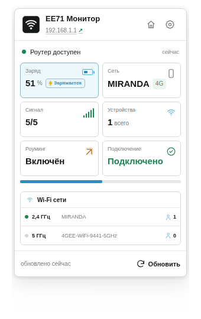
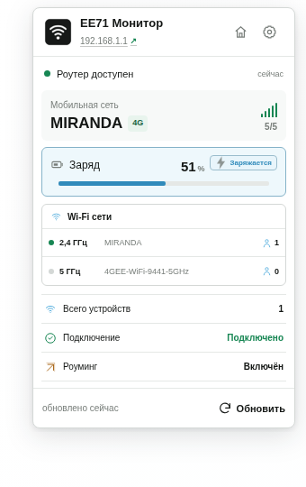
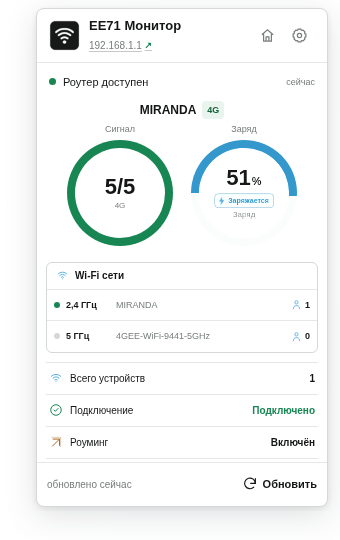
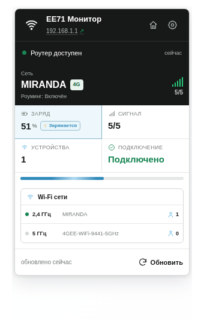

# EE71 Monitor

[English version](README.en.md)

EE71 Monitor — неофициальное расширение для Chrome, Opera, Яндекс Браузера и Firefox, которое показывает состояние мобильного роутера **Alcatel EE71**. Все данные читаются напрямую из роутера в локальной сети и не передаются во внешние сервисы.

Текущая версия для всех браузеров — `1.5.2`. Сборка Firefox универсальна для компьютеров и Firefox для Android 142+.

[Установить EE71 Monitor из Firefox Add-ons](https://addons.mozilla.org/ru/firefox/addon/ee71-monitor/)

> Проект не связан с Alcatel, TCL или оператором связи. Совместимость может зависеть от прошивки роутера.

## Возможности

- заряд батареи, мобильная сеть, тип сети, сигнал, подключение и роуминг;
- состояние Wi‑Fi 2,4 и 5 ГГц, SSID и число подключённых устройств;
- автоматическое и ручное обновление данных;
- прямой запрос доступа к адресу роутера из popup с автоматической повторной проверкой после выдачи разрешения;
- определение зарядки по штатному состоянию батареи роутера с резервной проверкой роста уровня;
- ровная голубая метка «Заряжается» с жёлтой мигающей молнией и плавным движущимся бликом на полосе заряда;
- заряд на значке расширения: его можно скрыть, показывать как `51%` или `51`, а при зарядке выбрать узкий голубой badge `↯51` либо только цвет; action-иконка при этом остаётся обычной;
- кликабельный адрес и кнопка с домиком для перехода на главную страницу роутера;
- уведомления о низком и полном заряде с настраиваемыми текстами;
- четыре варианта popup: «Сетка», «Акцент на сети», «Два кольца» и «Тёмная шапка»;
- русский и английский интерфейс, светлая и тёмная тема;
- локальная работа без аналитики, рекламы и облачных сервисов.

Размер шрифта текста на значке задаёт сам браузер, поэтому расширение не может менять его через настройки.

## Скриншоты

| Сетка | Акцент на сети | Два кольца | Тёмная шапка |
|:---:|:---:|:---:|:---:|
|  |  |  |  |

## Установка для разработки

Сначала создайте браузерные сборки:

```bash
node scripts/build.mjs
```

### Chrome и Opera

1. Откройте `chrome://extensions/` или `opera://extensions/`.
2. Включите режим разработчика.
3. Выберите «Загрузить распакованное расширение» и укажите `build/chrome`.

### Яндекс Браузер

1. Откройте `browser://extensions/` или `chrome://extensions/`.
2. Включите режим разработчика.
3. Загрузите папку `build/yandex`.

### Firefox на компьютере

1. Откройте `about:debugging#/runtime/this-firefox`.
2. Выберите «Загрузить временное дополнение».
3. Укажите `build/firefox/manifest.json`.

Временное дополнение удаляется после перезапуска Firefox. Для постоянной установки XPI должен быть подписан Mozilla.

### Firefox для Android

Та же папка `build/firefox` и тот же XPI предназначены для Firefox на компьютере и Android 142+. Временный запуск на Android выполняется через актуальный `web-ext` и ADB:

```bash
npx --yes web-ext@latest run --target firefox-android --source-dir build/firefox --adb-device DEVICE_ID --firefox-apk org.mozilla.firefox
```

## Настройка

Адрес роутера по умолчанию — `192.168.1.1`. Можно указать другой IP, имя хоста и необязательный порт, например `192.168.1.1:8080`. После сохранения браузер попросит разрешить доступ только к выбранному адресу.

Во вкладках настроек можно изменить интервал обновления, уведомления, язык, вид popup и отображение заряда на значке. В popup адрес роутера и кнопка с домиком открывают его главную страницу.

При обновлении расширения сохранённые настройки не перезаписываются: инициализация добавляет только параметры, появившиеся в новой версии.

Зарядка определяется по штатному полю состояния батареи, которое возвращает EE71. Если прошивка не предоставляет это поле, расширение резервно определяет зарядку по росту уровня между последовательными успешными обновлениями.

## Разрешения

| Разрешение | Назначение |
|---|---|
| `storage` | Хранение настроек и последнего статуса в браузере |
| `alarms` | Периодическое обновление |
| `notifications` | Уведомления о заряде |
| `declarativeNetRequestWithHostAccess` | Совместимый с роутером локальный запрос статуса |
| optional `http://*/*` | Доступ к адресу роутера после подтверждения пользователя |

Расширение не изменяет настройки роутера и не передаёт его данные третьим лицам. Подробнее: [политика конфиденциальности](PRIVACY.md).

## Сборки и проверка

Команда `node scripts/build.mjs` создаёт:

- `build/chrome` — Chrome и Opera;
- `build/firefox` — Firefox на компьютере и Android;
- `build/yandex` — Яндекс Браузер.

Unit‑тесты запускаются командой:

```bash
node tests/common.test.js
```

Готовые архивы версии 1.5.2 находятся в `dist/`. Инструкция для воспроизводимой сборки: [SOURCE_BUILD.md](SOURCE_BUILD.md). Изменения выпусков перечислены в [CHANGELOG.md](CHANGELOG.md).

## Поддержка и лицензия

Сообщения об ошибках и предложения принимаются в [GitHub Issues](https://github.com/antiefa/EE71-Monitor/issues).

Автор: [antiefa](https://github.com/antiefa). Код распространяется по лицензии [MIT](LICENSE).
